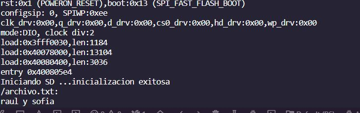

## Practica 6 Parte 1
***Raul Gonzalez / Sofia Valero***
## Codigo:

```
#include <SPI.h>
#include <SD.h>

File myFile;

void setup()
{
  Serial.begin(115200);
  Serial.print("Iniciando SD ...");
  if (!SD.begin(5)) {
    Serial.println("No se pudo inicializar");
    return;
  }
  Serial.println("inicializacion exitosa");
 
  myFile = SD.open("/archivo.txt");//abrimos  el archivo 
  if (myFile) {
    Serial.println("/archivo.txt:");
    while (myFile.available()) {
    	Serial.write(myFile.read());
    }
    myFile.close(); //cerramos el archivo
  } else {
    Serial.println("Error al abrir el archivo");
  }
}

void loop()
{
  
}

```
### Salida:
Este codigo se encarga de leer la tarjeta sd incorporada en el lector de tarjetas con el nombre *archivo.txt* y nos muestra por la consola el mensaje que en nuestro caso era: raul y sofia.



## Funcionamiento:
Antes de nada hay que declarar las librerias que vamos a usar,las variables,etc... en este caso las siguientes:

```
#include <SPI.h>
#include <SD.h>

```
Una vez hecho esto ya podemos empezar en el setup haciendo la comunicación serial, enviando un mensaje conforme iniciamos la tarjeta y declarando los pins necessarios.
Justo despues se inicializa la tarjeta y en caso de que de error nos mostrara un mensaje por pantalla, por lo contrario tambien nos dira si la inicializacion ha sido existosa.
```
File myFile;

void setup()
{
  Serial.begin(115200);
  Serial.print("Iniciando SD ...");
  if (!SD.begin(5)) {
    Serial.println("No se pudo inicializar");
    return;
  }
  Serial.println("inicializacion exitosa");
 
  myFile = SD.open("/archivo.txt");//abrimos  el archivo 
  if (myFile) {
    Serial.println("/archivo.txt:");
    while (myFile.available()) {
    	Serial.write(myFile.read());
    }
    myFile.close(); //cerramos el archivo
  } else {
    Serial.println("Error al abrir el archivo");
  }
}
```